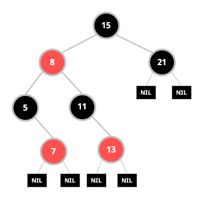
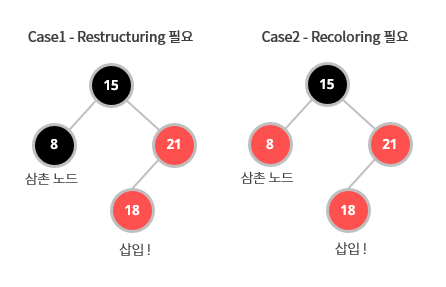
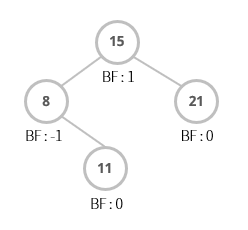

# Balanced binary search tree

```
균형이 맞지 않는 트리의 균형을 맞춰주는 알고리즘이 반영된 트리 구조
성능을 향상시키기 위한 노력

::: 검색 O(log N) / 삽입 O(log N) / 삭제 O(log N)
```

<br />

## Reb-Black Tree

<br />

```
동일한 수의 노드를 가질 때, depth를 최소화하여 시간복잡도를 줄이는 이진 탐색 트리
::: 검색 O(log N) / 삽입 O(log N) / 삭제 O(log N)
```

<br />

<p align="center"></p>

<br />
<br />

### \# 자바에서의 Reb-Black Tree 활용

<br />

- Collection 중 ArrayList의 내부적인 알고리즘
- HashMap의 충돌을 해결하기 위해 사용하는 방법 중 하나인 Separate Chaining에서 사용

<br />

### \# Reb-Black Tree가 균형을 유지하는 방법

<br />

Red-Black Tree는 균형을 유지하기 위해 다음의 규칙을 만족한다.

- 각 노드는 red 또는 black 색상을 가진다.
- Root 노드는 black이다.
- 모든 Leaf(NIL)는 black이다.
- 어떤 노드의 색깔이 red라면 두 개의 자식은 모두 black이다.
- **Root 노드부터 Leaf까지 black 노드의 개수는 같아야 한다.**

<br />

삽입과 삭제를 할 때는 트리의 균형을 유지할 수 있도록 Restructuring과 Recoloring을 한다.

삽입의 경우, 삽입할 노드를 Red로 지정하고 이진 탐색 트리처럼 삽입을 하고

1. 삽입한 노드의 삼촌 노드가 black이면 → Restructuring을
2. 삼촌 노드가 red이면 → Recoloring을 수행해서 균형을 맞춰준다. <br />

\*\* 삼촌 노드 : 부모 노드의 형제 노드

<br />
<br />

<p align="center"></p>

<br />
<br />

[이해에 도움이 되는 글](https://zeddios.tistory.com/237)

<br />
<br />

## AVL Tree

<br />

```
Balance Factor(BF)로 맞추는 균형
::: 검색 O(log N) / 삽입 O(log N) / 삭제 O(log N)
```

<br />

<p align="center"></p>

<br />

### \# AVL Tree가 균형을 유지하는 방법

AVL Tree는 균형을 유지하기 위해 다음의 규칙을 만족한다.

<br />

- BF는 -1, 0, 1로만 이루어져 있다.
- 특정 노드의 BF = (왼쪽 서브 트리의 높이) - (오른쪽 서브 트리의 높이)

<br />

이진 탐색 트리처럼 삽입을 한 후, BF 값이 -1 ~ 1 이외의 숫자를 가지면 **회전**을 통해 균형을 맞춰준다.

<br />

[이해에 도움이 되는 글](https://m.blog.naver.com/PostView.naver?isHttpsRedirect=true&blogId=dhdh6190&logNo=221062784111)

<br />

---

<br />

## 마무리

<br />
AVL 트리가 보다 엄격하게 균형을 이루고 있기 때문에 상대적으로 빠른 탐색을 제공한다. 반대로 Red-black 트리는 상대적으로 느슨한 균형을 이루고 있어 회전이 거의 이루어지지 않기 때문에 상대적으로 빠른 삽입과 삭제를 제공한다. 그래서 더 빠른 검색이 필요한 DB에서는 AVL 트리를 사용하고, 그 외 맵 구조 등 프로그래밍 언어 라이브러리에서는 Red-black 트리를 사용한다.
