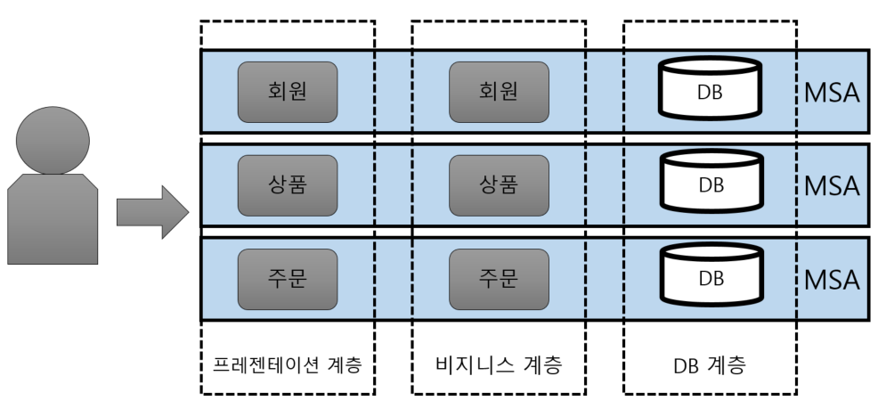

# MSA(Micro Service Architecture)
```
기능을 수행하는 서비스 단위 프레임워크
독립적 배포, 다른 기술 스택 사용 가능
```

</br>

MSA는 개발 속도와 성능을 지속적으로 높여갈 수 있는 구조</br>
MSA 이전에는 Monolithic 구조로 모든 구성요소가 한 프로젝트에 통합되어 개발되는 형태

</br>
</br>

## Monolithic과 MS의 차이
```
Monolithic = 모든 구성요소가 한 프로젝트에 통합
Micro Service = 기능별 서비스 단위로 구성
```

<p align="center"></p>

</br>

### 모놀리틱 구조

</br>

- 부분 기능의 장애가 전체 시스템에 영향
- 서비스 변겅 및 수정시 파악 지체
- 배포시간 증가
- 프레임워크나 언어에 종속적
  
</br>
  
### 마이크로서비스 구조

</br>

- 각 서비스별 개발로 개발 속도 증가, 유지보수 용이
- 독립적인 배포 가능
- 팀 단위 기술스택 사용 가능
- 메모리, CPU 자원 절약

</br>  

<p align="center"></p>

</br>
</br>

## MSA의 문제점
</br>

- 서비스 단위로 나뉘어져 있으므로 통신 장애 및 트랜잭션 유지와 같은 세부 기획 필요
- 서비스별 DB가 다양하므로 트랜잭션 유지 어려움
- 통합 테스트 어려움
- 실제 운영환경 배포 어려움
  
</br>
</br>

# Spring에서의 MSA

## [Spring Cloud](https://spring.io/cloud)
```
MSA 구성을 지원하는 SpringBoot기반 FrameWork
Public, Private 클라우드에 쉽게 운영, 배포
```

</br>

## Spring MS 패턴
```
장애 회복, 개발/검증/운영 서버 싱크 유지, 의존성 최소화 등등
견고한 MSA를 위해 구상한 구조 패턴 6가지
```

</br>

## 1️⃣ 마이크로서비스 핵심 개발 패턴

</br>

<p align="center"></p>

</br>

## 2️⃣ 마이크로서비스 라우팅 패턴

</br>

<p align="center"></p>

</br>

## 3️⃣ 마이크로서비스 클라이언트 회복성 패턴

</br>

<p align="center"></p>

</br>

## 4️⃣ 마이크로서비스 보안 패턴

</br>

<p align="center"></p>

</br>


## 5️⃣ 마이크로서비스 로깅 및 추적 패턴

</br>

<p align="center"></p>

</br>


## 6️⃣ 마이크로서비스 빌드 및 배포 패턴

</br>

<p align="center"></p>

</br>

## Spring Cloud Nexflix

</br>

<p align="center"></p>

</br>
</br>

# Front에서의 MSA = Micro Frontend
```
Micro Service처럼 전체 화면을 작동 단위로 나누어 개발 후 조립하는 방식
```

## 독립 팀별 애플리케이션 개발

</br>

<p align="center"></p>

</br>

## Micro FrontEnd 통합 
- UI 스타일 일관성 - UI Component Library
- 어플리케이션 통신 - Custom events
- 백엔드 호출 API 구성 - BFF(Backend for Frontend Pattern)

</br>

<p align="center"></p>

</br>
</br>

# BFF(Backend for Frontend)
```
MSA 패턴중 하나
여러 UI 기반 시스템이 여러 API 호출하고 통신하는 형태
```

</br>

<p align="center"></p>

</br>

# 마치며
 
 </br>

 관통 프로젝트를 개발하면서 MSA에 대한 지식없이 Spring과 Vue를 통한 개발 과정이 MSA 방식에 비슷하구나 라는 점을 공부하면서 알게되었습니다.</br> 단순히 따라 코딩하기만 하는 과정에서 이유없이 지나갔던 부분들을 다시 생각해볼 수 있었던 것 같습니다.

</br>
</br>

 # 참조

- [MSA](https://wooaoe.tistory.com/57)
- [Spring MSA](https://go-coding.tistory.com/79)
- [MicroFrontend](https://mobicon.tistory.com/572)
- [BFF](https://metleeha.tistory.com/entry/BFFBackend-for-Frontend-%EB%9E%80)
