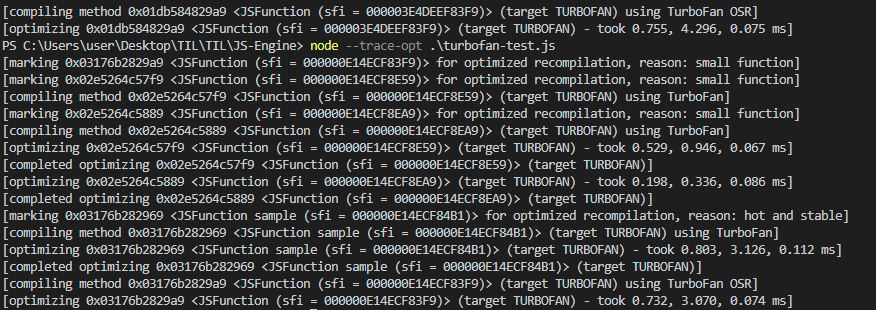

# 자바스크립트 엔진 V8


[1. 자바스크립트 엔진을 알아보기 전에](#자바스크립트-엔진을-알아보기-전에)

[2. 자바스크립트 엔진](#자바스크립트-엔진)

[3. V8에 대하여](#v8-엔진)

<br/>
<br/>

# 자바스크립트 엔진을 알아보기 전에 !

<br/>

## 인터프리터? 컴파일러?

- 인터프리터
  - 라인 단위로 읽고 실행시키는 방식
  - 실행시간은 오래 걸림
  - 메모리 효율성이 좋음
  - 실행 후에 오류를 확인할 수 있음
- 컴파일러
  - 프로그램 전체를 스캔하여 모두 기계어로 번역하는 방식
  - 초기 스캔 후 파일이 생성되면 실행 속도가 빨라짐
  - 메모리 효율성이 좋지 않음
  - 한번에 읽고 실행하기 때문에 실행 전에 오류 추적 가능

<br/>

## JIT 컴파일러(동적 번역)

> 인터프리터의 느린 속도를 보완하기 위해 인터프리터언어인 JS를 실행하는 시점에 바이트 코드를 기계어로 번역하는 컴파일 기법

.png?type=w800)


- 장점 
  - 실행 시간에 컴파일할지를 결정하는 것
  - 최적화를 일부 적용할 수 있는 점
- 단점
  - profiling data(동적 언어 정보)로 인한 오버헤드 발생으로 효과가 없을 수 있음

<br/>

📌 IR(Intermediate Representation) => 중간 표현 형식 
- IR = Byte Code + Profiling data(변수, 함수 정보)


## Adaptive JITC - V8 CrankShaft

> JIT의 단점을 보완하기 위한 확장된 JIT 컴파일러


- Runtime Profiler가 함수 호출 빈도를 측정해 JITC와 인터프리터 방식을 결정
- but, 동적 타입의 방식에 따라 비효율적일 수 있음

<br/>
<br/>

# 자바스크립트 엔진

> JS 코드를 바이트 코드로 변경하여 속도를 높이고 머신 코드로 변경하여 컴퓨터가 이해할 수 있게 전달하는 역할


### JS 엔진 동작 원리


<br/>

### AST(Abstract Syntax Tree)

- 파싱을 통한 소스 코드 구조화 작업

```javascript
function hello (name) {
  return 'Hello,' + name;
}


{
  type: 'FunctionDeclaration',
  name: 'hello'
  arguments: [
    {
      type: 'Variable',
      name: 'name'
    }
  ]
  // ...
}
```

- 함수명, 타입 등의 정보를 구조화하여 컴퓨터가 이해하기 쉽게 변경

<br/>

### [자바스크립트 엔진 동작 원리](https://www.betterweb.or.kr/blog/%EB%88%88%EC%97%90-%EB%B3%B4%EC%9D%B4%EB%8A%94-%EC%9E%90%EB%B0%94%EC%8A%A4%ED%81%AC%EB%A6%BD%ED%8A%B8-%EC%97%94%EC%A7%84-%EB%8F%99%EC%9E%91%EC%9B%90%EB%A6%AC/)


<br/>
<br/>


### 자바스크립트 구성 요소


- JS 엔진 구성 요소
  - Call Stack
  - Memory Heap
  - Task Queue


<br/>

### Call Stack

> 함수나 변수의 정보를 저장하는 공간으로 함수를 실행하는 과정에서 스택에 푸시와 팝을 통해 처리하는 자료구조

 

<br/>

### Memory Heap

> 동적으로 생성된 객체가 메모리에 할당되는 위치

<br/>

### Task Queue

> 처리할 메세지 목록, 실행할 콜백 함수 리스트로 이벤트나 http요청, 비동기 콜백 함수를 콜백 큐에 푸시한다

<br/>

### 📢 

- 결국 자바스크립트 엔진의 기본 구성 요소는 다르지 않고 브라우저별로 각 기업의 자체 엔진을 통해 동작원리를 수행한다.

<br/>
<br/>

# V8 엔진


> 구글에서 제작한 Chrome, Node.js에서 사용되는 자바스크립트 엔진

<br/>


- 일반적인 인터프리터 형식이 아닌 `바이트코드`로 컴파일하고 실행하는 방식

<br/>

### 5.9 버전 이하의 V8 엔진 구조

- 5.9 버전 이하의 V8은 Full-codegen을 이용하여 파싱된 js코드를 변형 없이 직접 머신코드로 번역하였음.
- 이때까지 중간 바이트 코드를 사용하지 않아 인터프리터가 필요하지 않음.
- 초기 V8은 TurboFan과 Ignition만을 이용하려 하였으나, 성능이 떨어져 Crankshaft와 같은 컴파일러와 함께 사용되었으며 복잡한 구조를 가졌음


- Full-codegen : 간단하고 빠른 컴파일러, 상대적으로 느린 머신 코드 생성
- Crankshaft : JIT 컴파일러로 최적화된 코드 생산
- Ignition : JS코드를 바이트코드로 변환하는 인터프리터
- TurboFan : 최적화 담당 컴파일러. Profiler의 데이터를 통해 기준에 맞는 코드를 가져와 최적화시키는 역할

<br/>


### 현재의 V8 엔진 구조

> 이전 버전의 Ignition과 TurboFan의 성능 향상으로 다른 기능들이 필요없어진 구조


<br/>

### V8 엔진의 동작 과정


1. 코드를 파싱하여 AST 구조 생성
2. Ignition을 통해 바이트 코드로 변환
3. TurboFan을 통해 코드 최적화
4. 최적화 머신 코드 전달

<br/>

## Ignition

> JS코드를 바이트코드로 변환하는 인터프리터


```javascript
function hello(name) {
  return "Hello," + name;
}
console.log(hello("changhyun"));
```

- 해당 파일을 `$ node --print-bytecode test.js`로 실행시키면 
바이트코드로 <br/>인터프리팅되는지 확인할 수 있다.


```
16505 E> 0xd9d80ae32f6 @    0 : a7                StackCheck 
16516 S> 0xd9d80ae32f7 @    1 : 1b 3e             LdaImmutableCurrentContextSlot [62]
16528 E> 0xd9d80ae32f9 @    3 : ac 00             ThrowReferenceErrorIfHole [0]
16527 E> 0xd9d80ae32fb @    5 : 2a 02 00          LdaKeyedProperty <this>, [0]
         0xd9d80ae32fe @    8 : 26 fb             Star r0
16537 E> 0xd9d80ae3300 @   10 : 28 fb 01 02       LdaNamedProperty r0, [1], [2]
         0xd9d80ae3304 @   14 : 97 04             JumpIfToBooleanTrue [4] (0xd9d80ae3308 @ 18)
         0xd9d80ae3306 @   16 : 12 02             LdaConstant [2]
16548 S> 0xd9d80ae3308 @   18 : ab                Return 
```

[📌 Star r0와 같은 명령어들이 궁금하다면](https://bumkeyy.gitbook.io/bumkeyy-code/javascript/understanding-v8s-bytecode)

<br/>

## TurboFan 최적화 기법

### 1. 인라이닝

> 가능한 많은 함수를 호출된 위치에 내용으로 변환하는 과정


<br/>

### 2. 히든 클래스

> 자바스크립트의 Prototype을 통한 데이터 관리


- 쉽게 말해 데이터 타입이 동적으로 변할 수 있기 때문에 히든 클래스 객체를 생성하여 변경된 정보를 저장하는 과정으로 클래스가 없는 JS의 한계를 어느정도 보완해주는 역할


<br/>

### 3. 인라인 캐싱

> 히든 클래스의 오프셋을 캐싱하여 조회 작업을 생략함으로서 성능을 향상시키는 작업


<br/>

## TurboFan 뜨거워진 코드 식히기

```cc
// v8/src/execution/rumtime-profiler.cc
OptimizationReason RuntimeProfiler::ShouldOptimize(JSFunction function, BytecodeArray bytecode) {
  // int ticks = 이 함수가 몇번 호출되었는지
  int ticks = function.feedback_vector().profiler_ticks();
  int ticks_for_optimization =
      kProfilerTicksBeforeOptimization +
      (bytecode.length() / kBytecodeSizeAllowancePerTick);
  if (ticks >= ticks_for_optimization) {
    // 함수가 호출된 수가 임계점인 ticks_for_optimization을 넘기면 뜨거워진 것으로 판단
    return OptimizationReason::kHotAndStable;
  } else if (!any_ic_changed_ && bytecode.length() < kMaxBytecodeSizeForEarlyOpt) {
    // 이 코드가 인라인 캐싱되지 않았고 바이트 코드의 길이가 작다면 작은 함수로 판단
    return OptimizationReason::kSmallFunction;
  }
  // 해당 사항 없다면 최적화 하지 않는다.
  return OptimizationReason::kDoNotOptimize;
}
```

- 실제 RuntimeProfiler의 메소드를 통해 뜨거워진 상태 `KHotAndStable`를 확인할 수 있음.
- `node --trace-opt 파일명`을 통해 최적화 과정을 추적할 수 있음.


<br/>




- 위와 같은 형태로 반복적인 함수가 사용되었을 때 `hot and stable`이라는 이유로 최적화 되었음을 알 수 있음.


<br/>
<br/>

# 마치며

- 자바스크립트 엔진의 동작과정과 원리를 파악해보면서 `컴파일러`와 `인터프리터`에 대한 개념 되짚어보기
- `Ignition`과 `TurboFan`등의 작동을 통해 최적화작업에 대한 이해
- 작동원리를 통해 최적화기법이 어떻게 실행되는지 파악하는 과정으로 지속적으로 업데이트되는 크롬의 엔진을 파악해볼 수 있었음

<br/>
<br/>

# 참고사이트

- [자바스크립트의 동작원리: 엔진, 런타임, 호출 스택](https://joshua1988.github.io/web-development/translation/javascript/how-js-works-inside-engine/)
- [How JavaScript works: inside the V8 engine + 5 tips on how to write optimized code](https://blog.sessionstack.com/how-javascript-works-inside-the-v8-engine-5-tips-on-how-to-write-optimized-code-ac089e62b12e)
- [V8 엔진은 어떻게 내 코드를 실행하는 걸까?](https://evan-moon.github.io/2019/06/28/v8-analysis/)
- [자바스크립트는 어떻게 작동하는가: V8 엔진의 내부 + 최적화된 코드를 작성을 위한 다섯 가지 팁](https://engineering.huiseoul.com/%EC%9E%90%EB%B0%94%EC%8A%A4%ED%81%AC%EB%A6%BD%ED%8A%B8%EB%8A%94-%EC%96%B4%EB%96%BB%EA%B2%8C-%EC%9E%91%EB%8F%99%ED%95%98%EB%8A%94%EA%B0%80-v8-%EC%97%94%EC%A7%84%EC%9D%98-%EB%82%B4%EB%B6%80-%EC%B5%9C%EC%A0%81%ED%99%94%EB%90%9C-%EC%BD%94%EB%93%9C%EB%A5%BC-%EC%9E%91%EC%84%B1%EC%9D%84-%EC%9C%84%ED%95%9C-%EB%8B%A4%EC%84%AF-%EA%B0%80%EC%A7%80-%ED%8C%81-6c6f9832c1d9)
- [[2020.10.16] Google Chrome V8 엔진을 파헤쳐보자](https://helloinyong.tistory.com/290)
- [[번역] Understanding V8’s Bytecode](https://bumkeyy.gitbook.io/bumkeyy-code/javascript/understanding-v8s-bytecode)
- [눈에 보이는 자바스크립트 엔진 동작원리](https://www.betterweb.or.kr/blog/%EB%88%88%EC%97%90-%EB%B3%B4%EC%9D%B4%EB%8A%94-%EC%9E%90%EB%B0%94%EC%8A%A4%ED%81%AC%EB%A6%BD%ED%8A%B8-%EC%97%94%EC%A7%84-%EB%8F%99%EC%9E%91%EC%9B%90%EB%A6%AC/)
- [Sneak peek into Javascript V8 Engine](https://medium.com/@poojasharma_93670/sneak-peek-into-javascript-v8-engine-d2bb2eb2bdb2)
- [Javascript 기초 - JavaScript 개발한다면 JIT은 알아야JIT](https://samslow.github.io/development/2020/07/06/JIT/)
- [자바스크립트 JIT](https://m.blog.naver.com/z1004man/221914280533)